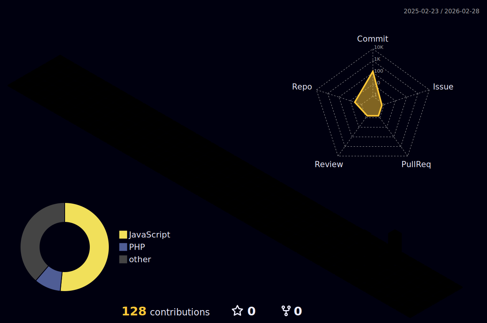

  
  
    

  

---

## <picture></picture> About Me

🎓 **Class:** Computer Science Student at **PSU**  
💻 **Main Quest:** Full-Stack Web Development  
🚀 **Current Mission:** Building **PSU Science Inventory System**  
📫 **Contact:** 

 

---

## <b> Skills & Tools</b>

 

### 📋 Frontend Development
 

  
### 🤖 Backend Development
 

  

  
### 💾 Database
 

  
### 🔧 Utilities & Tools
 

 

---

##  <b>Achievements & Stats</b>

 

  
   
  
  

